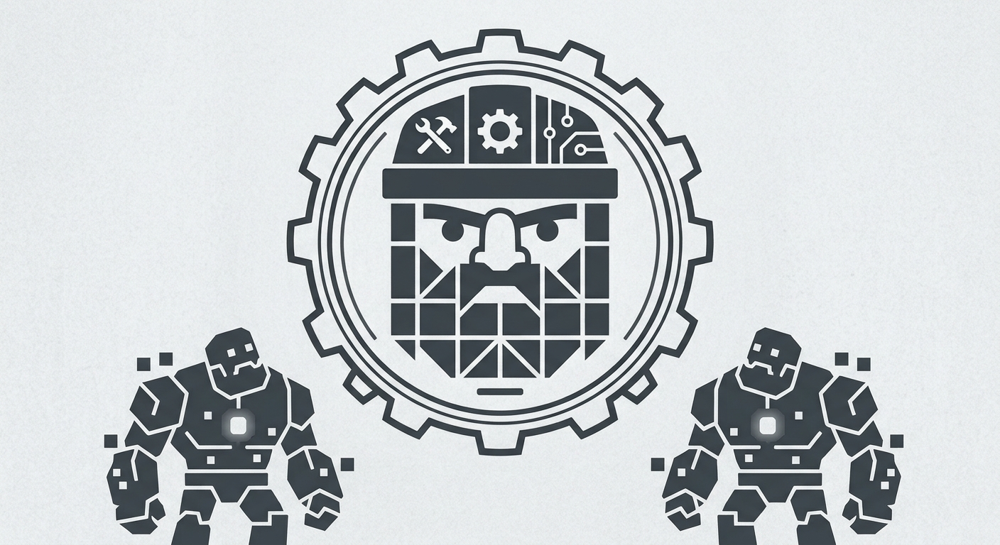

# kheled
Minimal AI Agent Framework my purposes (Kheled - Glas in neo-khuzdul language.

<p align="center">
  
</p>

Built to Build

This repository provides a stripped-down, lightweight foundation for an AI agent. Like a sturdy dwarf engineer, it arrives with a solid core, handles the fundamental scaffolding out of the box, and stays out of your way so you can forge and extend custom capabilities onto it.

Core Capabilities Ready Out of the Box

Base Loop: Clean prompt-to-execution control flow.

Minimal Setup: Zero unnecessary dependencies or bloated abstractions.

Extension-Ready: Modular design for adding tools, memory systems, or alternative LLM backends.

````text
__
                      __// //__
                     / // // / \
                    / // // /   \
                   /________\---/
                   |  ====  |  /
                   | ( ) ( ) |
                    \   /\  /
                     | ---- |
                     \      /
                      \____/

               __        ______  __
              /  \      / ____ \|  |
             / /\ \    | |    | |  |
            / /__\ \   | |____| |  |
           / /____\ \  |  ____  |  |
          /_/      \_\ | |    | |  |
                       |_|    |_|__|

    The foundations are laid, the forge is hot.
  This minimal AI agent is forged from iron and core
    functions, providing the essential logic for
    your command-line needs. It is built not to
  be a final machine, but a powerful engine upon
           which you can extend and build.

      The Anvil is Ready. Add Your Extensions.

````